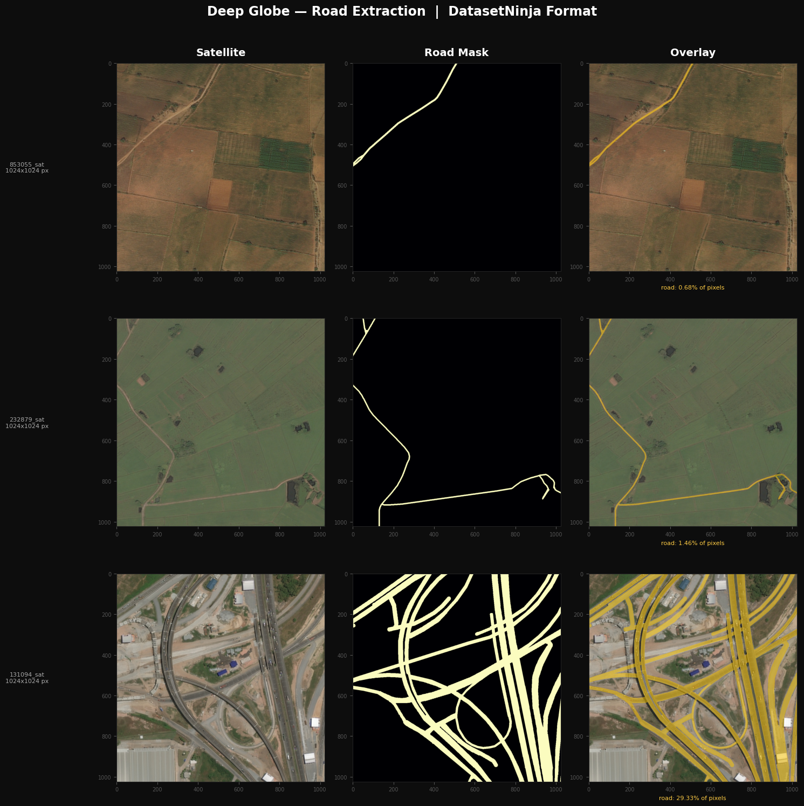
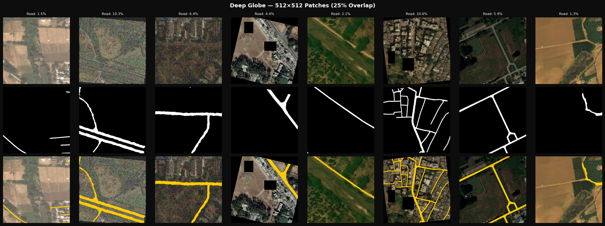

# Deep Globe Road Extraction

Semantic segmentation of roads from satellite imagery using the [Deep Globe 2018 Road Extraction dataset](http://deepglobe.org/challenge.html), with a LinkNet segmentation model and an EfficientNet-B2 encoder.

> **Status:** Work in progress. The full pipeline (data loading, patch extraction, model, and training loop) is implemented and runnable. Training has not been completed yet, so no final metrics are reported in this README. Results will be added once training is finished.

---

## Overview

Road extraction from satellite images is a common remote sensing task with applications in mapping, urban planning, and disaster response. This project builds a complete pipeline for this task:

1. **Data exploration** — load satellite tiles and their road annotations, and visualize them.
2. **Patch-wise data pipeline** — split large satellite tiles into overlapping patches for memory-efficient training, with augmentation.
3. **Model** — a LinkNet decoder on top of an EfficientNet-B2 encoder pretrained on ImageNet.
4. **Training** — a combined BCE + Dice + Connectivity loss, mixed-precision training, a cosine warm-restart learning rate schedule, checkpointing, and early stopping.

## Dataset

The [Deep Globe 2018 Road Extraction dataset](http://deepglobe.org/challenge.html) consists of 1024x1024 satellite images with pixel-level road annotations. This project uses the [DatasetNinja](https://datasetninja.com/) export format, where each image `*_sat.jpg` has a matching JSON annotation file `*_sat.jpg.json`. Roads are encoded either as a compressed bitmap mask or as a polygon.

Road coverage varies strongly across the dataset, from rural scenes with under 1% road pixels to dense urban interchanges with around 30% road pixels:



## Method

### Patch-wise dataset

Training on full 1024x1024 images requires a large amount of GPU memory. Instead, each image is split into **512x512 patches with 25% overlap** (384 px stride), extracted on the fly:

- Only patch coordinates are stored in memory; pixels are loaded and cropped lazily in `__getitem__`.
- For the **training set**, patches with less than 0.5% road pixels are filtered out, to avoid the dataset being dominated by empty background patches.
- The **validation and test sets** keep all patches, so evaluation reflects the true data distribution.
- Augmentations include flips, 90-degree rotations, `ShiftScaleRotate`, `ElasticTransform` / `GridDistortion` (for road curvature), color/brightness jitter, Gaussian noise, and `CoarseDropout`.



### Model

A **LinkNet** architecture (from [`segmentation_models_pytorch`](https://github.com/qubvel/segmentation_models.pytorch)) with an **EfficientNet-B2** encoder pretrained on ImageNet (~7.9M parameters total). EfficientNet-B2 was selected as a balance between segmentation quality and the VRAM limit of a 6 GB consumer GPU. LinkNet's decoder adds skip connections rather than concatenating them, keeping the decoder lightweight relative to a U-Net.

### Loss function

A weighted combination of three terms:

| Term | Weight | Purpose |
|---|---|---|
| BCE (with `pos_weight=6`) | 0.3 | Pixel-wise classification, adjusted for class imbalance (roads are a minority class) |
| Dice loss | 0.5 | Directly optimizes overlap (IoU-style) |
| Connectivity loss | 0.2 | Penalizes broken/fragmented road predictions, computed on a downsampled mask |

### Training setup

- Optimizer: `AdamW`, learning rate `1e-3`, weight decay `1e-4`
- Scheduler: `CosineAnnealingWarmRestarts` (restarts after 10, 20, 40 epochs)
- Mixed-precision training (`torch.cuda.amp`) with gradient clipping
- Checkpointing of the best model (by validation IoU) and the latest state, for resuming
- Early stopping with a patience of 7 epochs

## Repository structure

```
.
├── DeepGlobe.ipynb     # Full pipeline: data exploration, dataset, model, training
├── assets/             # Preview images used in this README
├── requirements.txt    # Python dependencies
└── README.md
```

The dataset itself is not included in this repository. Download the Deep Globe 2018 Road Extraction dataset (DatasetNinja format) and place it as:

```
deepglobe-2018-road-extraction-DatasetNinja/
└── train/
    ├── img/   # *_sat.jpg
    └── ann/   # *_sat.jpg.json
```

## Setup

```bash
git clone <repo-url>
cd <repo-name>
pip install -r requirements.txt
```

A CUDA-capable GPU is recommended. The default configuration (batch size 8, 512x512 patches, EfficientNet-B2) is designed to fit within 6 GB of VRAM (tested target: RTX 3060).

## Usage

Open `DeepGlobe.ipynb` and run the cells in order:

1. **Dataset exploration** — sanity-checks that images and annotations match, and visualizes a few samples.
2. **Patch-wise dataset** — builds the train/val/test dataloaders and shows dataset statistics.
3. **Model** — defines the LinkNet + EfficientNet-B2 model and prints an architecture summary.
4. **Training** — trains the model. On an RTX 3060 with batch size 8, expect roughly 25-30 minutes per epoch.

Training can be resumed from `checkpoints/latest_checkpoint.pth` by setting `RESUME_TRAINING = True`.

## Results

Training is not yet complete. This section will be updated with validation IoU, Dice, precision/recall, and qualitative predictions once training finishes.

## Possible extensions

- Compare against other encoders (EfficientNet-B0/B3, ResNet34) using the size/IoU table printed in the model cell.
- Compare LinkNet against U-Net or D-LinkNet decoders.
- Evaluate on full 1024x1024 images using sliding-window inference with overlap blending.

## References

- Demir, I. et al. "DeepGlobe 2018: A Challenge to Parse the Earth through Satellite Images." CVPR Workshops, 2018.
- Chaurasia, A. and Culurciello, E. "LinkNet: Exploiting Encoder Representations for Efficient Semantic Segmentation." VCIP 2017.
- Tan, M. and Le, Q. "EfficientNet: Rethinking Model Scaling for Convolutional Neural Networks." ICML 2019.
